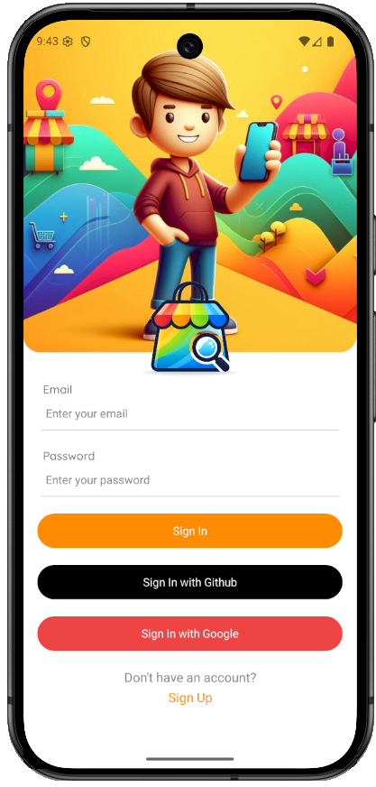
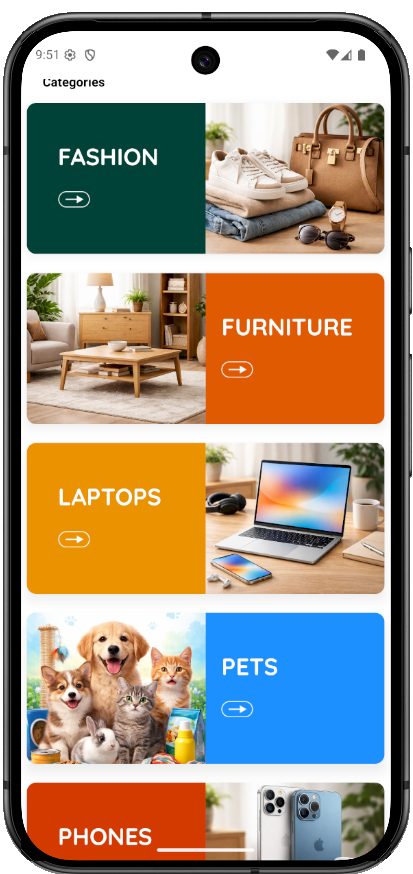

# react-native-connect-marketplace

Frontend for backend made with golang: [golang-connect-marketplace](https://github.com/simonasbuj/golang-connect-marketplace) 

## Tech Stack

- **React Native**
- **Expo**
- **Expo Router**
- **TypeScript**
- **NativeWind (Tailwind CSS)**
- **TanStack Query (React Query)**
- **JWT Authentication**

### Screenshot

   
  

